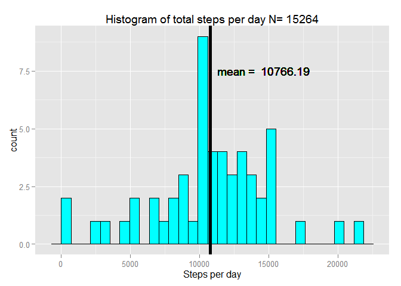
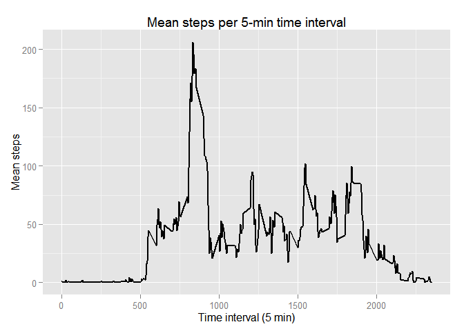
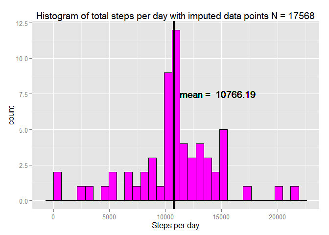
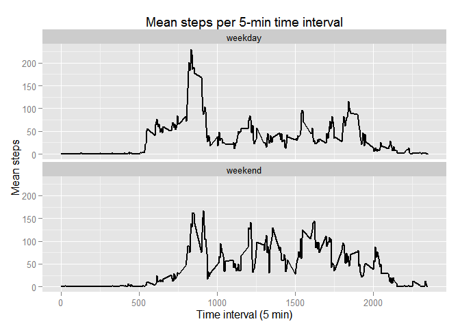

# Reproducible Research: Peer Assessment 1


```r
library(dplyr)    #For data manipulation
```

```
## 
## Attaching package: 'dplyr'
## 
## The following object is masked from 'package:stats':
## 
##     filter
## 
## The following objects are masked from 'package:base':
## 
##     intersect, setdiff, setequal, union
```

```r
library(ggplot2)  #For plotting
library(lubridate)#For handling date/time objects
```

## Loading and preprocessing the data

```r
activity_df <- tbl_df(read.csv("activity.csv"))
summary(activity_df)
```

```
##      steps                date          interval     
##  Min.   :  0.00   2012-10-01:  288   Min.   :   0.0  
##  1st Qu.:  0.00   2012-10-02:  288   1st Qu.: 588.8  
##  Median :  0.00   2012-10-03:  288   Median :1177.5  
##  Mean   : 37.38   2012-10-04:  288   Mean   :1177.5  
##  3rd Qu.: 12.00   2012-10-05:  288   3rd Qu.:1766.2  
##  Max.   :806.00   2012-10-06:  288   Max.   :2355.0  
##  NA's   :2304     (Other)   :15840
```

```r
total_per_day <- activity_df %>% group_by(date) %>% summarise(sum = sum(steps))
mean_per_interval <- activity_df %>% group_by(interval) %>% summarise(mean_steps = mean(steps, na.rm = T))
```

## What is mean total number of steps taken per day?


There are 61 total days in the data set. The mean number of steps taken per day is 10766. The standard deviation of the number of steps is 4269. The median number of steps taken per day is 10765.

 

## What is the average daily activity pattern?

```r
max_mean_steps <- max(mean_per_interval)
```

The maximum number of mean steps per interval was 2355


```r
g <- ggplot(aes(x = interval, y = mean_steps), data = mean_per_interval)
g <- g + geom_line(size = 0.75)
g <- g + labs(title =  "Mean steps per 5-min time interval")
g <- g + xlab("Time interval (5 min)")
g <- g + ylab("Mean steps")
g
```

 

## Imputing missing values

```r
missing_count <- sum(is.na(activity_df$steps))
```

There are 2304 missing data values (i.e. 'NA') in the input data set. For the purposes of comparison we will assume any missing value has the average for that interval. We will use `mutate` and `ifelse` from dplyr for this transformation.


```r
activity_df <- activity_df %>%
    group_by(interval) %>%
    mutate(fixed_steps = ifelse(is.na(steps), mean(steps, na.rm=T), as.numeric(steps)))
total_per_day <- activity_df %>% group_by(date) %>% summarise(sum = sum(fixed_steps))

mean_w_imputed   <- mean(total_per_day$sum, na.rm = T)

g <- ggplot(aes(x = sum), data = total_per_day) + geom_histogram(colour = "black", fill = "magenta")
g <- g + labs(title = paste("Histogram of total steps per day with imputed data points N =", sum(!is.na(activity_df$fixed_steps))) )
g <- g + xlab("Steps per day")
g <- g + geom_vline(xintercept = mean_w_imputed, show_guide = T, size = 2)
g <- g + geom_text(aes((mean + 500), 7.5), label = paste("mean = ", round(mean_w_imputed,2)), hjust = 0)
g
```

 

The mean before we imputed data was 10766. The mean calculated after replacing NA data values was 10766. The addition of the imputed values did not significantly impact our analysis. This may not always be the case, depending on how missing values are distributed.

## Are there differences in activity patterns between weekdays and weekends?

```r
activity_df <- activity_df %>% mutate(weekday = weekdays(ymd(date)))
activity_df <- activity_df %>% mutate(isWeekday = ifelse((weekday == "Sunday" | weekday == "Saturday"), "weekend", "weekday" ))
activity_df$isWeekday <- as.factor(activity_df$isWeekday)
mean_per_interval <- activity_df %>% group_by(interval, isWeekday) %>% summarise(mean_steps = mean(fixed_steps, na.rm = T))
```


```r
g <- ggplot(aes(x = interval, y = mean_steps), data = mean_per_interval) + facet_wrap(~isWeekday, ncol =1)
g <- g + geom_line(size = 0.75)
g <- g + labs(title =  "Mean steps per 5-min time interval")
g <- g + xlab("Time interval (5 min)")
g <- g + ylab("Mean steps")
g
```

 

There are differences in behavior between weekdays and weekends. Subjects display more early morning activity on weekdays than on weekdays.

